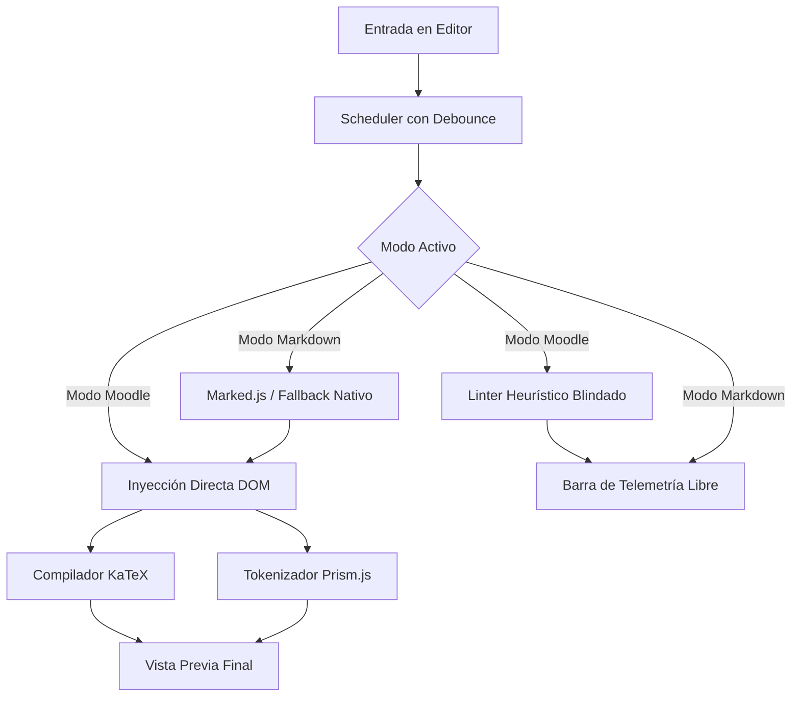

# Preview Suite (Moodle & Markdown)

[](https://github.com/Klopezxd/preview-suite)
[](LICENSE)
[](https://preview-suite.vercel.app)
[](https://klopezxd.github.io/preview-suite/)
[](https://katex.org/)
[](https://prismjs.com/)
[](https://marked.js.org/)
[](https://developer.mozilla.org/es/docs/Web/JavaScript)

> **Entorno interactivo y reactivo para redacción, visualización y validación en tiempo real de documentos técnicos y académicos con soporte para KaTeX, Prism.js y Markdown (GFM).**

---

## 🌐 Despliegue en Producción (Demo en Vivo)

La aplicación se encuentra disponible de forma pública y con alta disponibilidad a través de su infraestructura en Vercel y su réplica de respaldo en GitHub Pages:

* 🚀 **Vercel (Producción Principal):** **[https://preview-suite.vercel.app](https://preview-suite.vercel.app)**
  * **Acceso directo al Modo Moodle:** [https://preview-suite.vercel.app/#moodle](https://preview-suite.vercel.app/#moodle)
  * **Acceso directo al Modo Markdown:** [https://preview-suite.vercel.app/#markdown](https://preview-suite.vercel.app/#markdown)

* 🔗 **GitHub Pages (Espejo de Respaldo):** [https://klopezxd.github.io/preview-suite/](https://klopezxd.github.io/preview-suite/)

---

## 📋 Descripción del Proyecto

Una suite unificada diseñada tanto para desarrollo de contenidos de aulas virtuales como para visualización y redacción de documentos en Markdown:
- **Modo Moodle:** Diseñado para código HTML y componentes de aulas virtuales. Valida el renderizado exacto de tablas, avisos y fórmulas KaTeX antes de publicar en Moodle u otras plataformas educativas.
- **Modo Markdown:** Visor y editor universal de Markdown (GFM) para redactar notas, documentación y apuntes con renderizado instantáneo de fórmulas matemáticas en LaTeX, bloques de código y exportación rápida.
- **Detección sintáctica:** Alerta de etiquetas HTML sin cerrar o bloques Markdown residuales.
- **Soporte matemático riguroso:** KaTeX en línea `\( ... \)` y en bloque `\[ ... \]` o `$$ ... $$`.

**Previsualizador Moodle & Markdown** resuelve estas necesidades mediante una arquitectura web modular blindada contra excepciones y fallos de entorno, 100% responsiva para ordenadores, tablets y smartphones.

---

## 🛡️ Blindaje Técnico, Interactividad y Resiliencia (Novedades v3.1)

1. **Parser Markdown Resiliente con Modo Offline / Respaldo Nativo:**
   - Si el CDN de `marked.js` no carga o la red se interrumpe, el sistema activa automáticamente un parser nativo interno seguro, evitando pantallas en blanco o bloqueos del editor.
2. **Sistema de Zoom Ergonómico e Híbrido Estilo Overleaf:**
   - Píldoras interactivas en cabeceras (`14px` en editor, `100%` en vista previa) que muestran el valor en vivo sin tapar el contenido.
   - Atajos de ratón (`Ctrl + Rueda`), teclado (`Ctrl + 0`) y clic directo en la lupa para restablecer en PC.
   - Soporte táctil nativo **Pinch-to-zoom (2 dedos)** y micro-popovers flotantes exclusivos para pantallas táctiles (móviles y tablets).
   - Blindaje nativo con `<meta name="darkreader-lock">` y `color-scheme: dark;` para desactivar extensiones invasivas de oscurecimiento forzado.
3. **Calibración Visual Óptima (80%-83%):**
   - Reducción proporcional del grosor de la barra superior, cabeceras e inferior para maximizar el área de trabajo y legibilidad del código.
   - Botoneras unificadas sin divisiones internas, botón "Limpiar" reactivo con iluminación en Rojo Nórdico (`#FF4757`) y conmutador de modo dinámico bicolor (Violeta Boreal `#A855F7` para Markdown y Ámbar Solar `#FF9234` para Moodle).
4. **Capa Segura de Almacenamiento (`SafeStorage`):**
   - Acceso blindado a `localStorage` con captura de excepciones para garantizar funcionamiento en navegación privada, modo incógnito estricto (Safari/Firefox) o entornos corporativos restringidos.
5. **Control de Validación de Archivos:**
   - Límite de seguridad de 5 MB por archivo para prevenir congelamientos del navegador.
   - Filtro de extensiones permitidas (`.html`, `.htm`, `.md`, `.markdown`, `.txt`) con rechazo amigable de binarios.
6. **Auto-cierre y Envoltura Inteligente de Delimitadores (Estilo IDE):**
   - Si se selecciona texto y se presiona `(`, `[`, `{`, `"`, `'` o `` ` ``, el editor envuelve la selección automáticamente sin borrar el texto.
7. **Aislamiento de Condiciones de Carrera:**
   - Limpieza atómica de temporizadores de *debounce* y grabación de historial al conmutar entre modos, impidiendo sobreescrituras accidentales de buffers.
8. **Accesibilidad Universal (WCAG 2.1):**
   - Tarjetas interactivas del Hub navegables y activables mediante teclado (<kbd>Tab</kbd> + <kbd>Enter</kbd> / <kbd>Espacio</kbd>).
   - Anillos de enfoque `:focus-visible` calibrados en CSS.

---

## 🚀 Características Funcionales

### 1. Hub de Entrada Elegante y Conmutación de Modos
- **Pantalla de Bienvenida Permanente:** Menú inicial de selección con diseño Dark IDE que presenta con claridad las herramientas disponibles.
- **Acceso por Hash:** Soporte para enlaces directos (`#moodle` y `#markdown`) con sincronización en el historial del navegador.
- **Navegación Intuitiva:** Clic en el logotipo o título para volver a la pantalla de bienvenida (Hub) y botón conmutador único para alternar instantáneamente entre Modo Moodle y Modo Markdown preservando los borradores en memoria.

### 2. Modo Moodle (HTML Semántico Continuo)
- **Lienzo de Renderizado Moodle:** Simulación exacta de tarjeta de aula virtual en modo claro y oscuro.
- **Linter Heurístico de Sintaxis:**
  - Detección inmediata de residuos de IA (```` ``` ```` o ```html````).
  - Alerta de etiquetas desbalanceadas (`<table>` y `<pre>`).
  - Detección de delimitadores LaTeX huérfanos.
  - Salto de cursor directo a la línea del error con un clic en la píldora de telemetría.
- **Telemetría Libre:** Contador de palabras, caracteres y líneas en tiempo real sin límites artificiales.

### 3. Modo Markdown (GFM + Motor KaTeX)
- **Especificación Completa:** Soporte para encabezados, tablas comparativas, listas de tareas (`- [x]`) y bloques de código Prism.
- **Fórmulas Matemáticas Integradas:** Delimitadores LaTeX en bloque (`$$ ... $$`, `\[ ... \]`) y en línea (`\( ... \)`).
- **⭐ Exportador a Moodle:** Botón que compila el Markdown a HTML continuo semántico limpio, formateando las tablas con clases nativas y enviándolo al portapapeles listo para pegar.

### 4. Compilación Matemática y Resaltado Léxico
- **KaTeX Engine (v0.16.11):** Compilación matemática en menos de 5 ms en el cliente.
- **Prism.js (v1.29.0):** Resaltado léxico de Python, C++, Java, LaTeX, JavaScript, SQL y R con tema Tomorrow.

---

## 🏗️ Flujo de Procesamiento del Sistema



---

## ⌨️ Matriz de Atajos de Teclado

| Atajo | Acción | Descripción |
| :--- | :--- | :--- |
| <kbd>Tab</kbd> | **Indentar Texto** | Inserta 2 espacios de indentación respetando la selección |
| <kbd>Ctrl</kbd> + <kbd>Z</kbd> | **Deshacer** | Revierte el último cambio mediante pila de historial del modo activo |
| <kbd>Ctrl</kbd> + <kbd>Y</kbd> / <kbd>Ctrl</kbd> + <kbd>Shift</kbd> + <kbd>Z</kbd> | **Rehacer** | Restaura el cambio revertido |
| <kbd>Ctrl</kbd> + <kbd>Rueda</kbd> / <kbd>Ctrl</kbd> + <kbd>0</kbd> | **Zoom de Panel** | Ajuste y restablecimiento ergonómico de zoom en editor o vista previa |
| <kbd>Ctrl</kbd> + <kbd>Shift</kbd> + <kbd>C</kbd> | **Copiar Contenido** | Copia el contenido del editor al portapapeles |
| <kbd>Ctrl</kbd> + <kbd>Enter</kbd> | **Actualizar Render** | Fuerza una compilación síncrona manual de KaTeX y Prism |
| <kbd>Ctrl</kbd> + <kbd>P</kbd> | **Exportar / Imprimir** | Diálogo de impresión calibrado para formato A4 |
| <kbd>Esc</kbd> | **Cerrar Diálogos** | Cierra cualquier modal o menú flotante abierto |

---

## 🛠️ Estructura del Repositorio

```text
preview-suite/
├── css/
│   ├── styles.css        # Layout dual, design tokens, temas y print A4
│   └── hub.css           # Pantalla de bienvenida y tarjetas de selección
├── js/
│   ├── config.js         # Constantes, configuraciones, límites y plantillas base
│   ├── linter.js         # Inspector heurístico de sintaxis crítica protegido
│   ├── markdown.js       # Transpilador Markdown con protección LaTeX y fallback
│   └── app.js            # Controlador central, router, SafeStorage y eventos
├── index.html            # Estructura limpia HTML5
├── .editorconfig         # Consistencia de formato (2 espacios, LF, UTF-8)
├── .gitignore            # Exclusión de temporales y notas privadas
├── .nojekyll             # Bypass de Jekyll para GitHub Pages
├── CHANGELOG.md          # Bitácora histórica según estándar Keep a Changelog
├── LICENSE               # Licencia libre MIT
└── README.md             # Documentación oficial del proyecto
```

---

## 📦 Ejecución y Despliegue

### 1. Ejecución en Local (Sin conexión ni dependencias)

La suite está diseñada para funcionar inmediatamente sin requerir entornos Node.js ni compiladores:

* **Método A (Doble Clic Directo):**  
  Clona el repositorio o descarga el archivo ZIP, abre la carpeta y haz **doble clic en `index.html`** para ejecutarlo directamente en Google Chrome, Microsoft Edge, Mozilla Firefox o Safari a través del protocolo nativo `file:///`.
* **Método B (Servidor Local con Python o VS Code):**  
  Para simular un entorno idéntico a producción:
  ```bash
  # Iniciar servidor local nativo con Python en el puerto 8000:
  python -m http.server 8000
  ```
  Luego abre en tu navegador: `http://localhost:8000`.

### 2. Despliegue en GitHub Pages

1. Sube este repositorio a tu cuenta de GitHub.
2. Ve a **Settings** > **Pages** en tu repositorio.
3. En **Build and deployment**, selecciona la fuente **Deploy from a branch**.
4. Elige la rama `main` y la carpeta `/ (root)`.
5. Haz clic en **Save**. En menos de 2 minutos estará publicado globalmente.

---

## 📜 Historial de Cambios (Changelog)

Consulta el archivo [CHANGELOG.md](CHANGELOG.md) para revisar en detalle la evolución completa del software, desde el prototipo inicial en MathJax hasta la versión actual v3.1.

---

## 👨‍💻 Autor

**Klever López**  
*Estudiante de Tecnologías de la Información (TI)*  
GitHub: [@Klopezxd](https://github.com/Klopezxd)

---

## 📄 Licencia

Este proyecto está distribuido bajo la licencia libre **MIT**. Consulta el archivo [LICENSE](LICENSE) para obtener más detalles sobre los términos de uso, modificación y distribución.
