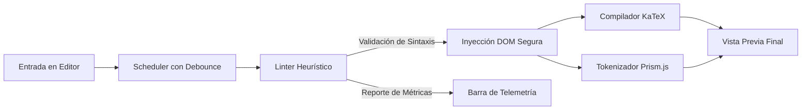

# Previsualizador Moodle v2.0

[](https://github.com/Klopezxd/previsualizador-moodle)
[](LICENSE)
[](https://klopezxd.github.io/previsualizador-moodle/)
[](https://katex.org/)
[](https://prismjs.com/)
[](https://developer.mozilla.org/es/docs/Web/JavaScript)

> **Entorno interactivo y reactivo de alta fidelidad para desarrollo, validación heurística y renderizado en tiempo real de contenidos académicos destinados a plataformas LMS (Moodle).**

---

## 🌐 Despliegue en Producción (Demo en Vivo)

La aplicación se encuentra disponible de forma pública y sin costo de infraestructura a través del siguiente enlace oficial:

🔗 **[https://klopezxd.github.io/previsualizador-moodle/](https://klopezxd.github.io/previsualizador-moodle/)**

Compatible con navegadores modernos en sistemas de escritorio (Windows, macOS, Linux) y dispositivos móviles (Android, iOS).

---

## 📋 Descripción del Proyecto

En el contexto de la educación superior y la formación técnica virtual, la elaboración de materiales didácticos, guías de laboratorio, estudios de caso y aportes en foros de discusión dentro de la plataforma **Moodle** presenta desafíos recurrentes:

- Incompatibilidad o renderizado fallido de fórmulas matemáticas complejas.
- Inserción involuntaria de artefactos de texto generados por herramientas de IA (residuos de etiquetas Markdown).
- Etiquetas HTML desbalanceadas que alteran la estructura visual de las aulas virtuales.
- Ciclos lentos de prueba y error que obligan a publicar contenido incompleto o con errores en la plataforma de producción.

**Previsualizador Moodle v2.0** resuelve estas problemáticas ofreciendo un entorno de trabajo síncrono, liviano y desacoplado, que simula el entorno de renderizado de Moodle en el navegador del usuario con latencia cero y validación proactiva de sintaxis.

---

## 🚀 Características Arquitectónicas y Funcionales

### 1. Compilación Matemática Síncrona (KaTeX Engine)
- **Rendimiento Ultraligero:** Integración del compilador KaTeX (v0.16.11), optimizado para renderizar fórmulas matemáticas en menos de 5 milisegundos, reduciendo el consumo de memoria en un **85%** frente a soluciones como MathJax.
- **Soporte Completo de Delimitadores:**
  - **Fórmulas en Bloque:** `\[ ... \]` y `$$ ... $$`
  - **Fórmulas en Línea:** `\( ... \)` y `$ ... $`
- **Tolerancia y Aislamiento de Errores:** En caso de sintaxis LaTeX inválida, el sistema captura la excepción de forma aislada, señalando el error sin interrumpir el flujo de trabajo del editor.

### 2. Inspector Estático de Sintaxis Crítica (Cero Falsas Alarmas)
El editor incorpora un motor de telemetría y validación heurística de contenido en tiempo real:
- **Detección de Residuos de IA:** Localiza bloques de código Markdown huérfanos (```` ``` ```` o ```` ```html ````) generados inadvertidamente al copiar contenido de asistentes de inteligencia artificial.
- **Validación Estructural de HTML:** Identifica tablas no cerradas (`<table>`) o bloques de código preformateado desbalanceados (`<pre>`).
- **Navegación Directa de Errores:** Alerta interactiva con salto de foco automático hacia la línea exacta del documento donde se originó el conflicto.

### 3. Arquitectura Autónoma (Single-File Architecture - SFA)
- **Portabilidad Absoluta:** Diseñado bajo el patrón de arquitectura de archivo único. Puede ejecutarse localmente con doble clic sobre el archivo `.html` sin requerir entornos de desarrollo Node.js, compiladores ni servidores locales.
- **Zero-Dependency Vector System:** Sistema de iconografía embebido mediante un diccionario de símbolos SVG (`<symbol>`). Elimina dependencias de webfonts de terceros (como FontAwesome), ahorrando más de 450 KB en transferencias de red y previniendo efectos FOUT/FOIT.
- **Privacidad Estricta (Client-Side Only):** Toda la computación y procesamiento se ejecuta en la memoria del navegador. No se transmiten datos ni contenidos académicos hacia servidores externos.

### 4. Interfaz Adaptativa y Soporte Táctil Avanzado
- **Modo Escritorio (> 768px):** Distribución de panel dual (código fuente / vista previa) con divisor arrastrable mediante la API de `PointerEvents`.
- **Modo Móvil (≤ 768px):** Disposición vertical con jerarquía ergonómica y control táctil suave (`touchmove`).
- **Contención de Desbordamiento Seguro:** Las tablas con múltiples columnas y las expresiones matemáticas extensas cuentan con desplazamiento horizontal encapsulado para no romper el layout.

### 5. Motor de Exportación e Impresión Formato A4
- Hoja de estilos `@media print` calibrada al milímetro para formatos estándar A4.
- Supresión automática de paneles de control, barras de estado y elementos no editoriales.
- Preservación fidedigna de los esquemas cromáticos de sintaxis (Prism Tomorrow) y fuentes vectoriales nítidas aptas para generación de informes PDF profesionales vía `Ctrl + P`.

---

## 🏗️ Flujo de Datos del Sistema



---

## ⌨️ Matriz de Atajos de Teclado

| Atajo | Acción | Descripción |
| :--- | :--- | :--- |
| <kbd>Tab</kbd> | **Indentar Código** | Inserta 2 espacios de indentación respetando la selección |
| <kbd>Ctrl</kbd> + <kbd>Z</kbd> | **Deshacer** | Revierte el último cambio mediante pila de historial |
| <kbd>Ctrl</kbd> + <kbd>Y</kbd> | **Rehacer** | Restaura el cambio revertido |
| <kbd>Ctrl</kbd> + <kbd>Shift</kbd> + <kbd>C</kbd> | **Copiar Código** | Copia el contenido íntegro del editor al portapapeles |
| <kbd>Ctrl</kbd> + <kbd>Enter</kbd> | **Actualizar Render** | Fuerza una compilación síncrona manual de KaTeX y Prism |
| <kbd>Ctrl</kbd> + <kbd>P</kbd> | **Exportar / Imprimir** | Abre el diálogo nativo de impresión calibrado para A4 |
| <kbd>Esc</kbd> | **Cerrar Diálogos** | Cierra cualquier modal o menú flotante abierto |

---

## 🛠️ Stack Tecnológico y Estándares

- **Lenguajes:** HTML5 Semántico, CSS3 Moderno (Variables CSS / Design Tokens, Flexbox, CSS Grid), JavaScript ES6+ (Strict Mode, IIFE).
- **Motores Externos (CDN Unificado):**
  - [KaTeX v0.16.11](https://katex.org/) — Compilación matemática en tiempo real.
  - [Prism.js v1.29.0](https://prismjs.com/) — Resaltado léxico de bloques de código.
- **Tipografía:** [Inter](https://fonts.google.com/specimen/Inter) y [JetBrains Mono](https://fonts.google.com/specimen/JetBrains+Mono) (Subconjunto latino optimizado).
- **Estándares de Calidad:** Principios Clean Code, arquitectura sin estado en servidor, separación de responsabilidades y accesibilidad semántica.

---

## 📦 Ejecución y Despliegue

### Ejecución Local
1. Clona este repositorio o descarga el código fuente:
   ```bash
   git clone https://github.com/Klopezxd/previsualizador-moodle.git
   ```
2. Abre directamente el archivo `index.html` en tu navegador preferido:
   - Doble clic en el explorador de archivos, o
   - Arrastra el archivo hacia una ventana de Google Chrome, Mozilla Firefox, Microsoft Edge o Safari.

### Despliegue en GitHub Pages
1. Sube el repositorio a tu cuenta de GitHub.
2. Ingresa a **Settings** > **Pages** en el repositorio.
3. En la sección **Build and deployment**, selecciona la fuente **Deploy from a branch**.
4. Configura la rama `main` (o `master`) y la carpeta `/ (root)`.
5. Haz clic en **Save**. En pocos minutos tu previsualizador estará activo globalmente.

---

## 👨‍💻 Autor

**Klever López**  
*Estudiante de Tecnologías de la Información (TI)*  
GitHub: [@Klopezxd](https://github.com/Klopezxd)

---

## 📄 Licencia

Este proyecto está distribuido bajo la licencia libre **MIT**. Consulta el archivo [LICENSE](LICENSE) para obtener más detalles sobre los términos de uso, modificación y distribución.
